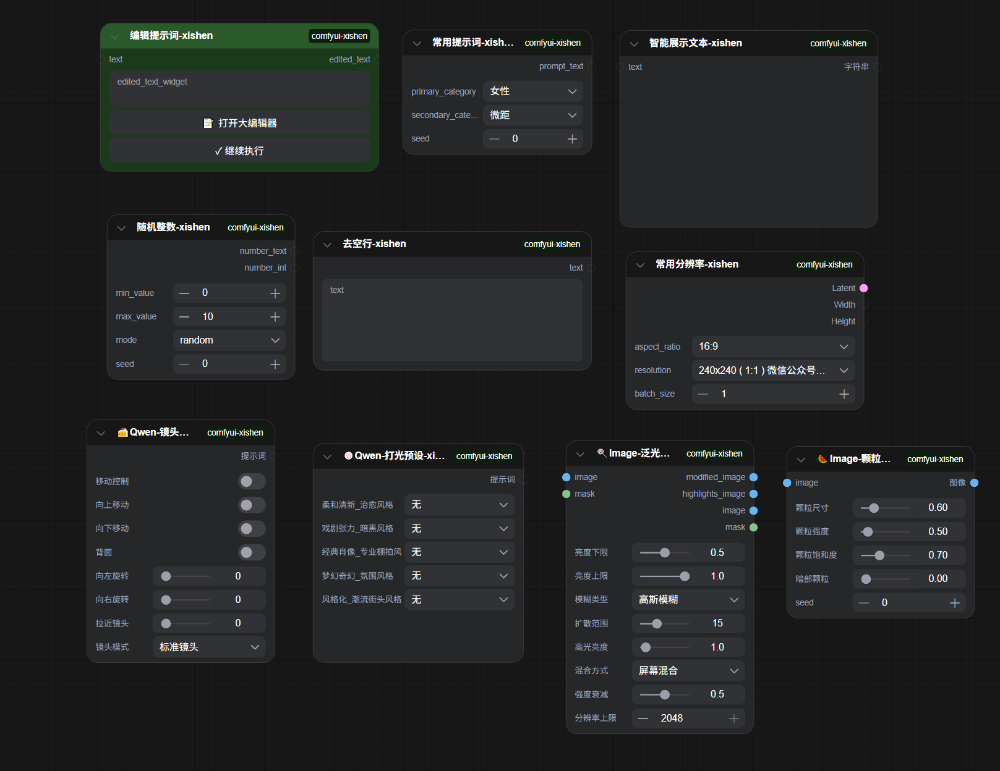

# comfyui-xishen / ComfyUI Xishen Nodes

## 简介 / Overview
本插件为方便个人使用的整合节点包，部分节点实现参考开源代码，版权归属原作者，所有人可随意修改使用。

- 提供12个实用节点，涵盖随机数生成、分辨率控制、提示词管理、图像效果等功能
- 复制到 ComfyUI 的 `custom_nodes` 目录并重启后即可使用，搜索 `xishen` 或 `Comfyui-xishen` 即可找到

## 安装 / Installation
1. 打开终端，进入 ComfyUI/custom_nodes 目录
2. 克隆仓库：`git clone https://github.com/xishen022/comfyui-xishen.git`
3. 重启 ComfyUI

## 使用指南

### 节点列表
所有节点都位于 **🍡Comfyui-xishen** 类别下：

#### 1. 随机整数-xishen
- **功能**: 生成指定范围内的随机整数
- **主要输入**: 最小值、最大值、随机模式（随机/序列）、随机种子
- **输出**: 整数文本、整数值
- **特色**: 序列模式循环计数，随机模式支持种子控制

#### 2. 常用分辨率-xishen
- **功能**: 快速生成常用分辨率的潜在空间
- **主要输入**: 预设分辨率、批量张数
- **输出**: Latent、宽度、高度
- **特色**: 自动对齐到16的倍数，符合Stable Diffusion要求

#### 3. 常用提示词-xishen
- **功能**: 根据分类生成随机提示词
- **主要输入**: 主分类、风格分类、随机种子
- **输出**: 提示词文本
- **特色**: 内置丰富提示词库，支持种子控制

#### 4. 主题分类选择-xishen
- **功能**: 动态加载并选择分类
- **主要输入**: 主分类、二级分类（动态加载）、控制选项
- **输出**: 二级分类名称
- **特色**: 支持设置生效或随机输出

#### 5. 去空行-xishen
- **功能**: 移除文本中的空白行
- **主要输入**: 文本（支持多行）
- **输出**: 处理后的文本
- **特色**: 保留原有换行风格，适合提示词预处理

#### 6. 智能展示文本-xishen
- **功能**: 智能展示多行文本
- **主要输入**: 文本（强制输入）
- **输出**: 处理后的文本
- **特色**: 固定高度带滚动条，节点窗口自动适应

#### 7. 批量控制-xishen
- **功能**: 控制批量处理数量
- **主要输入**: 输入（图像/LATENT/掩码）、批量张数
- **输出**: 实际批量张数
- **特色**: 自动调整，防止超出输入限制

#### 8. 🍡Qwen-尺寸预设
- **功能**: 快速生成预设尺寸的潜在空间
- **主要输入**: 尺寸预设、批量张数、对齐选项
- **输出**: Latent
- **特色**: 支持1:1、3:4、4:3、9:16、16:9等常用比例

#### 9. 🍥Qwen-打光预设
- **功能**: 生成各种风格的打光提示词
- **主要输入**: 5种打光风格选项
- **输出**: 提示词
- **特色**: 涵盖治愈、暗黑、棚拍、奇幻、街头等风格

#### 10. 🍭Image-泛光效果
- **功能**: 为图像添加辉光效果
- **主要输入**: 图像、亮度范围、模糊类型、扩散范围、混合方式
- **输出**: 处理后图像、高光图像、原图像、掩码
- **特色**: 增强画面光感和梦幻感

#### 11. 🍰Qwen-镜头预设
- **功能**: 生成镜头视角控制提示词
- **主要输入**: 移动控制、旋转控制、镜头模式
- **输出**: 提示词
- **特色**: 快速调整AI绘画中的相机视角

#### 12. 🍉Image-颗粒质感
- **功能**: 为图像添加电影颗粒效果
- **主要输入**: 图像、颗粒尺寸、强度、饱和度、暗部控制、种子
- **输出**: 处理后图像
- **特色**: 模拟胶片摄影的颗粒质感

#### 13. 定时关机高级-xishen
- **功能**: 根据条件执行系统操作（关机、重启、睡眠、休眠）
- **主要输入**: 批次号、动作类型、时间类型、倒计时秒数、目标时间、启用计时器、取消计时器
- **输出**: 状态信息、计时器详情
- **特色**: 支持倒计时/特定时间两种模式，跨平台兼容，线程安全设计

## 使用技巧
- 在搜索框输入 `xishen` 快速找到所有节点
- 随机整数节点的 `number_text` 可直接接入CLIP Text Encode
- 常用分辨率节点的 `Latent` 输出建议连接到KSampler
- 去空行节点适合在提示词编码前清理文本

## 许可 / License
- MIT 许可，详见仓库内 `LICENSE` 文件
